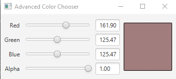
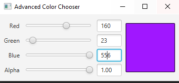

## Advanced Color Chooser

(Advanced Project: Color Chooser App Modification) The property bindings we created in the Color Chooser app (Section 13.4 ) allowed a TextField’s text to update when a Slider’s value changed, but not vice versa. JavaFX also supports bi-directional property bindings. Research bidirectional property bindings online, then create bidirectional bindings between the Sliders and the TextFields such that modifying a TextField’s value updates the corresponding slider

### ScreenShots:
 
With the slider regulations

 
With the textField regulations
