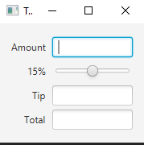
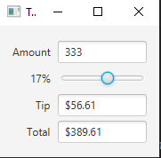
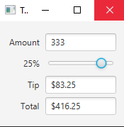

## Advanced TipsCalculator

The Tip Calculator app from Section 12.5 does not need a Button to perform its calculations. Re-implement this app to use property listeners to perform the calculations whenever the user modifies the bill amount or changes the custom tip percentage. Also use a property binding to update the Label that displays the tip percentage

### ScreenShots:
 

With the slider 

---
 

With the slider regulations equal to 15%

---
 

With the slider regulations equal to 15%

---

## Software:
JavaFX SDK 11.0.2 ( https://openjfx.io/)
Scene Builder 11.0.0 (https://gluonhq.com/products/scene-builder/)
IntelliJ IDEA ( https://www.jetbrains.com/idea/)

For VM options :--module-path ${PATH_TO_JAVAFX} --add-modules javafx.controls,javafx.fxml ;${PATH_TO_JAVAFX} - path to JavaFX library 

---

## Author:
Karlygash Kussainova
