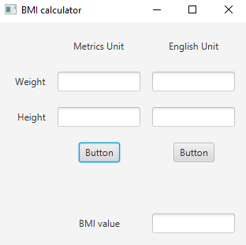
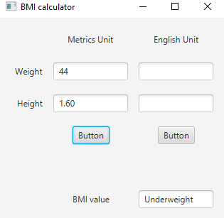
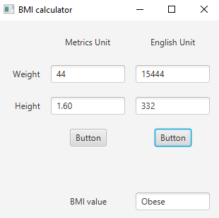

## BMI calculator

Create a BMI calculator app that allows users to enter their weight and height and whether they are entering these values in English or metric units, then calculates and displays the user’s body mass index.

The app should also display the following information from the Department of Health and Human Services/National Institutes of Health so that users can evaluate their BMIs:

BMI VALUES -->
Underweight:	less than 18.5 | 
Normal:	between 18.5 and 24.9 | 
Overweight:	between 25 and 29.9 | 
Obese:	30 or greater

### ScreenShots:
 

Without giving any value

---
 

Giving standart metrics

---
 

Giving English metrics

---

## Software:
JavaFX SDK 11.0.2 ( https://openjfx.io/)
Scene Builder 11.0.0 (https://gluonhq.com/products/scene-builder/)
IntelliJ IDEA ( https://www.jetbrains.com/idea/)

For VM options :--module-path ${PATH_TO_JAVAFX} --add-modules javafx.controls,javafx.fxml ;${PATH_TO_JAVAFX} - path to JavaFX library 

---

## Author:
Karlygash Kussainova
