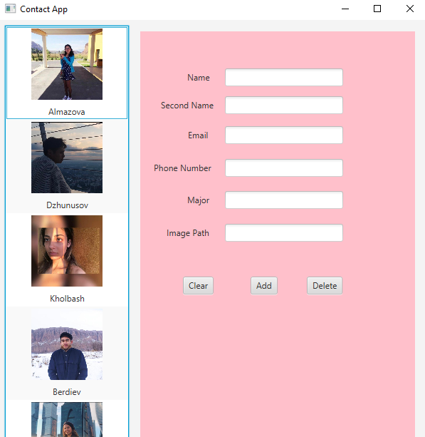
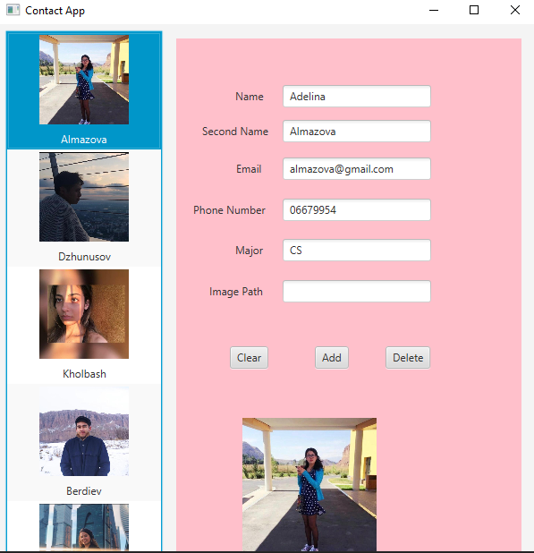
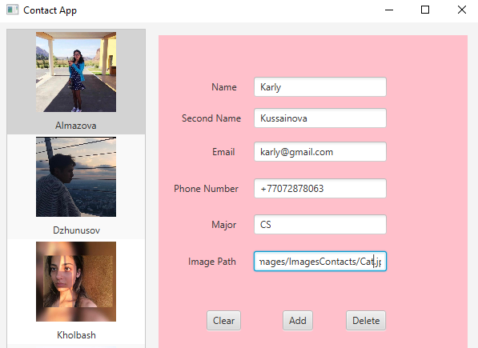
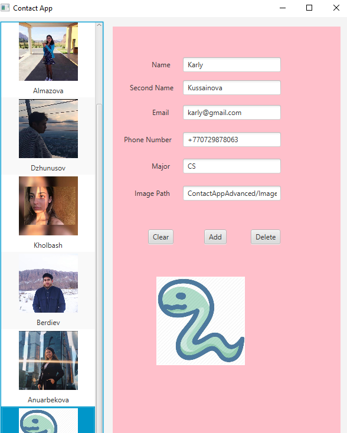

## Advanced Contact App With Icons

Modify the Contacts app from the preceding exercises to include an image for each Contact. Provide a custom ListView cell factory that displays the Contact’s full name and picture with the names in sorted order by last name.

### ScreenShots:
 

Without giving any value

---
 

When select a contact from the left toolbar

---
 
  

When enter a new user

---

## Software:
JavaFX SDK 11.0.2 ( https://openjfx.io/)
Scene Builder 11.0.0 (https://gluonhq.com/products/scene-builder/)
IntelliJ IDEA ( https://www.jetbrains.com/idea/)

For VM options :--module-path ${PATH_TO_JAVAFX} --add-modules javafx.controls,javafx.fxml ;${PATH_TO_JAVAFX} - path to JavaFX library 

---

## Author:
Karlygash Kussainova
