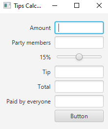
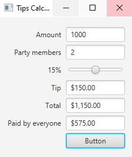

## Simple Contact App 

Design and Implement the Tip Calculator app from Chapter 12, section 12.5.

### ScreenShots:
 

Without giving any value

---
 

When enter value and chage the slider

---

## Software:
JavaFX SDK 11.0.2 ( https://openjfx.io/)
Scene Builder 11.0.0 (https://gluonhq.com/products/scene-builder/)
IntelliJ IDEA ( https://www.jetbrains.com/idea/)

For VM options :--module-path ${PATH_TO_JAVAFX} --add-modules javafx.controls,javafx.fxml ;${PATH_TO_JAVAFX} - path to JavaFX library 

---

## Author:
Karlygash Kussainova
