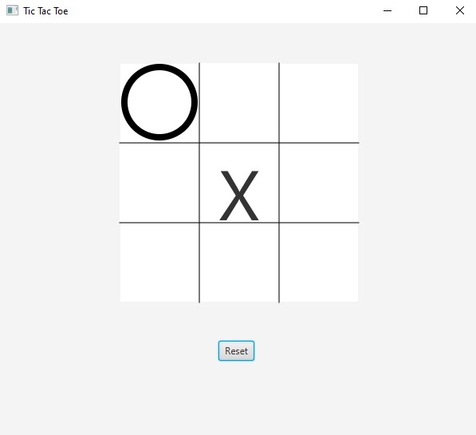
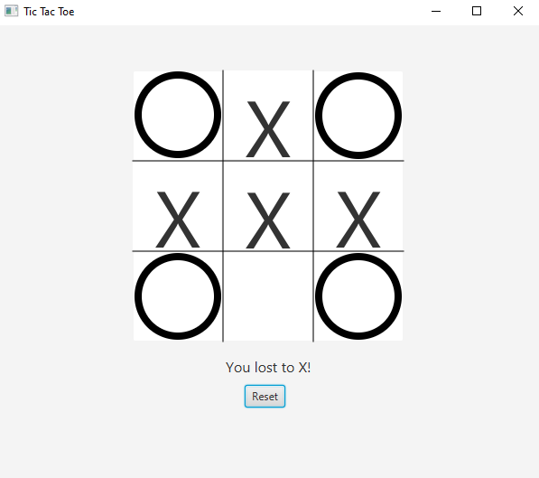
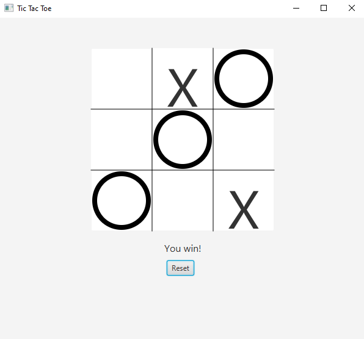
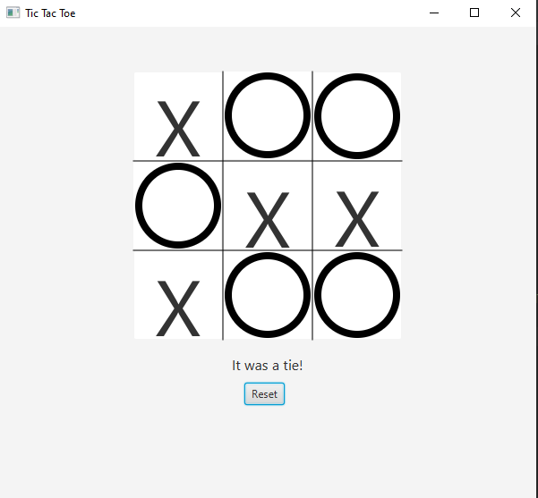
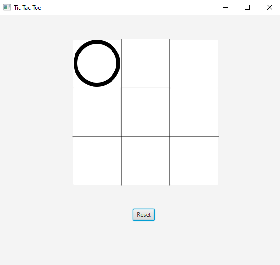
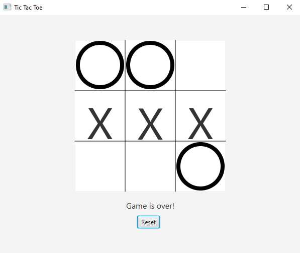
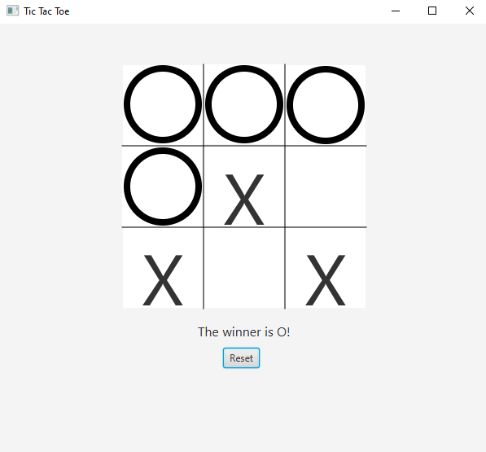

## Tic Tac Toe game 
This is a simple game Tic Tac Toe, which is designed for two players. Therefore, the given project has two options for the user: either to play against the computer or against some other plyer. There are 9 squares and 8 winning positions for the players.
Players can occupy the squares with X-s or O-s. In case, any of the players places his/her signs to the winning positions first, he/she wins the game. The winning positions are next:

|   |  |  |  |
| -------------     | -------------  |------------- |-------------  |
|         |  | | |
|         |  | | |
|   |  |  |  |

In order to see both version of the game (playing agaisnt computer and against another player), change the controller in the TicTacToe.fxml file. 
If you want to play against computer, choose TicTacToeController.java, and if you wan to play with another player, choose ControllerPlayers.java.

## Software:
- JavaFX SDK 11.0.2 ( https://openjfx.io/) 
- Scene Builder 11.0.0 (https://gluonhq.com/products/scene-builder/) 
- IntelliJ IDEA ( https://www.jetbrains.com/idea/) 
- For VM options :--module-path ${PATH_TO_JAVAFX} --add-modules javafx.controls,javafx.fxml ;${PATH_TO_JAVAFX} - path to JavaFX library 

## Screen shots and the feature list

### Feature list: 
|  Planned features |  Implemented features|  Yet to implement features |
| -------------     | -------------  |-------------  |
| -use buttons to make signs appear  -use smart algorithms to randomly generate a move   -use a randomizer   -create a scoring system |-used shapes and line to make signs appear  -used 'Initializable' class to play the game simultnously   -used a randomizer to randomly create a new move   -used shapes visibility to hide/show the signs|-use more features to make the interface more user-friendly   (instructions + a choice between two versions of the game)  -use smart algorithms to randomly generate a move   -create a scoring system  |

|  Screenshot |  Description|  
| -------------     | -------------  |
|  | This is how the app looks like when you play    against a computer: whenever you choose the square, a randomly generated number from 1 to 9 appears and occupies a free space as an X  |
|  | This is how the app looks like when you loose to the computer ( you loose to X) |
|  | This is how the app looks like when you win over the computer ( you are O) |
|  | This is how the app looks like when noone wins and it is a tie (for both versions)|
|  | This is how the app looks like when the first player starts the game|
|  | This is how the app looks like when the second player occupies the square|
|  | This is how the app looks like when the first player wins|
|  | This is how the app looks like when the second player wins|
|   |  | 

---

