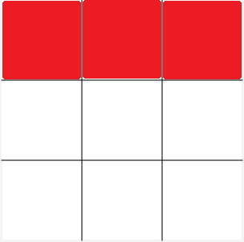
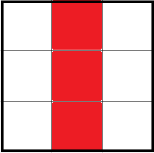
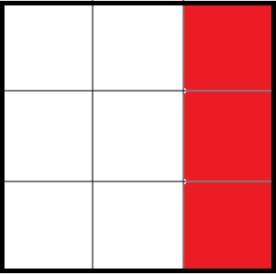
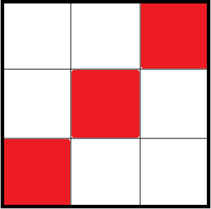
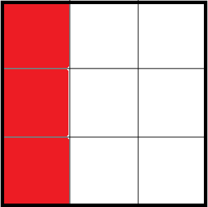
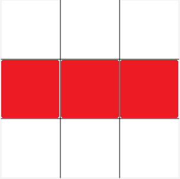
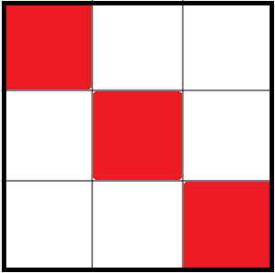

## Tic Tac Toe game 
This is a simple game Tic Tac Toe, which is designed for two players. Therefore, the given project has two options for the user: either to play against the computer or against some other plyer. There are 9 squares and 8 winning positions for the players.
Players can occupy the squares with X-s or O-s. In case, any of the players places his/her signs to the winning positions first, he/she wins the game. The winning positions are next:

---

|   |  |  |  |
| -------------     | -------------  |------------- |-------------  |
|         |  | | |
|         |  | | |
|   |  |  |  |

---
