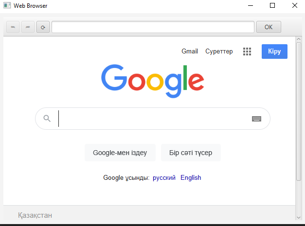
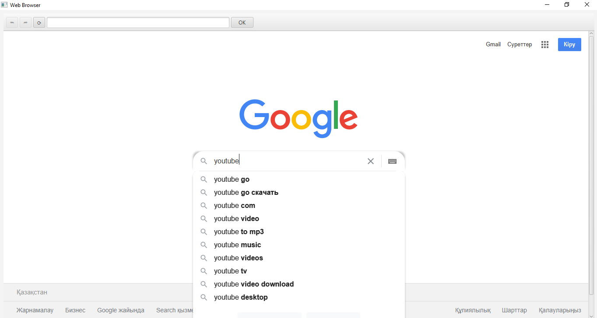
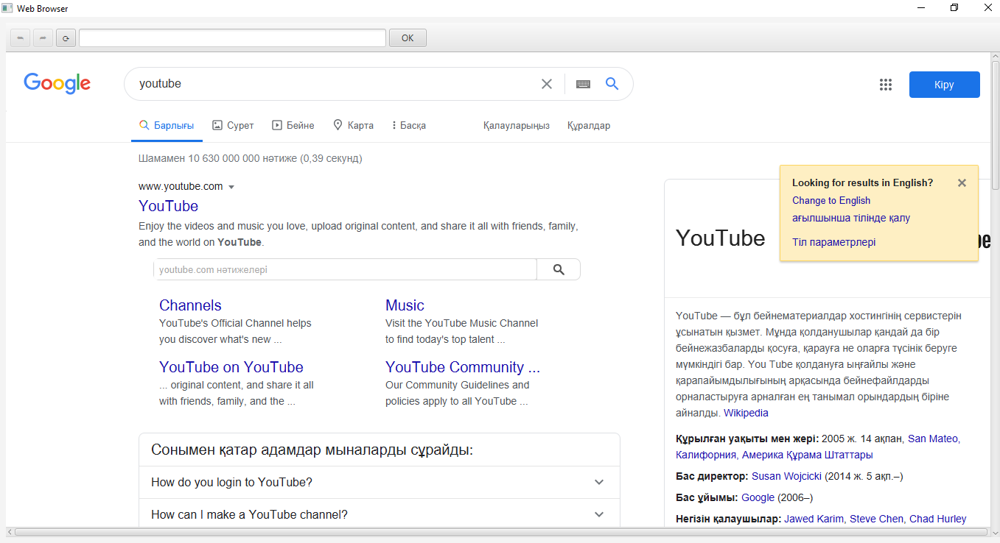

## Web Browser App

 Investigate the capabilities of JavaFX’s WebView control and WebEngine class, then create a JavaFX app that provides basic web browsing capabilities. For an introduction to these classes visit https://docs.oracle.com/search/?
 
### ScreenShots:
 

Initial State

---
 

Googling...

---
 

Found results

---

## Software:
JavaFX SDK 11.0.2 ( https://openjfx.io/)
Scene Builder 11.0.0 (https://gluonhq.com/products/scene-builder/)
IntelliJ IDEA ( https://www.jetbrains.com/idea/)

For VM options :--module-path "C:\javafx-sdk-11.0.2\lib" --add-modules=javafx.swing,javafx.graphics,javafx.fxml,javafx.media,javafx.web --add-reads javafx.graphics=ALL-UNNAMED --add-opens javafx.controls/com.sun.javafx.charts=ALL-UNNAMED --add-opens javafx.graphics/com.sun.javafx.iio=ALL-UNNAMED --add-opens javafx.graphics/com.sun.javafx.iio.common=ALL-UNNAMED --add-opens javafx.graphics/com.sun.javafx.css=ALL-UNNAMED --add-opens javafx.base/com.sun.javafx.runtime=ALL-UNNAMED

---

## Author:
Karlygash Kussainova
