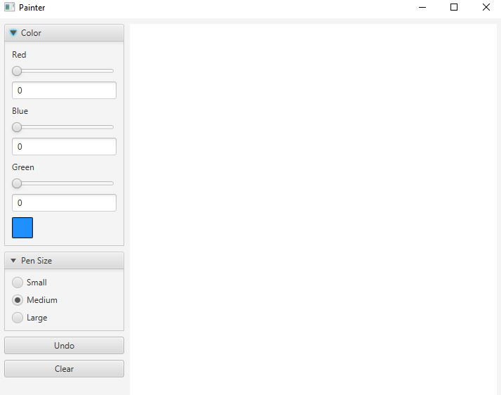
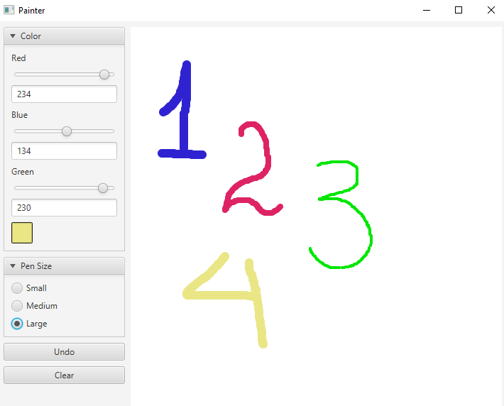
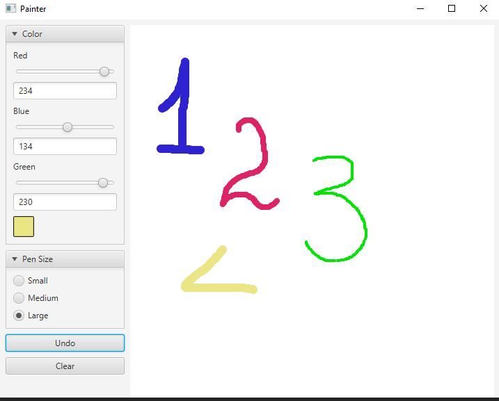
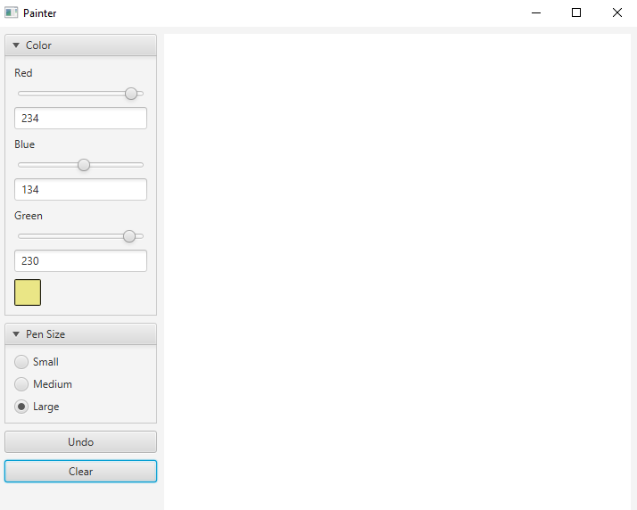

## Advanced Painter

Incorporate the RGBA color chooser you created in the Color Chooser app (Section 13.4 ) into the Painter app (Section 13.3 ) so that the user can choose any drawing color. Changing a Slider’s value should update the color swatch displayed to the user and set the brushColor instance variable to the current Color

### ScreenShots:
 

The initial state

---
 

Drawings with different colors and sizes

---
 

Undo

---
 

Clear

---

## Software:
JavaFX SDK 11.0.2 ( https://openjfx.io/)
Scene Builder 11.0.0 (https://gluonhq.com/products/scene-builder/)
IntelliJ IDEA ( https://www.jetbrains.com/idea/)

For VM options :--module-path ${PATH_TO_JAVAFX} --add-modules javafx.controls,javafx.fxml ;${PATH_TO_JAVAFX} - path to JavaFX library 

---

## Author:
Karlygash Kussainova
